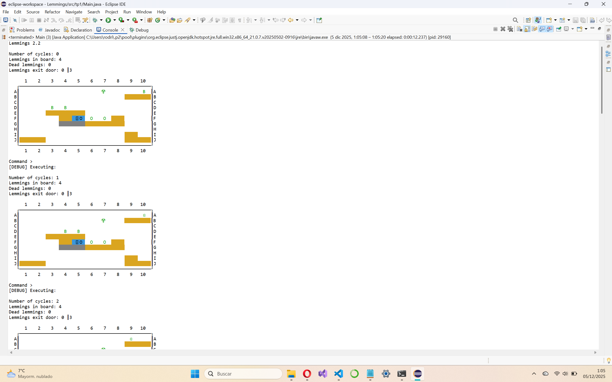
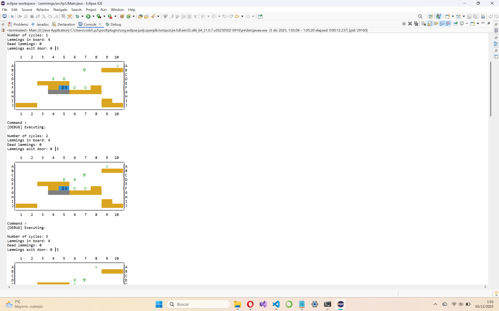
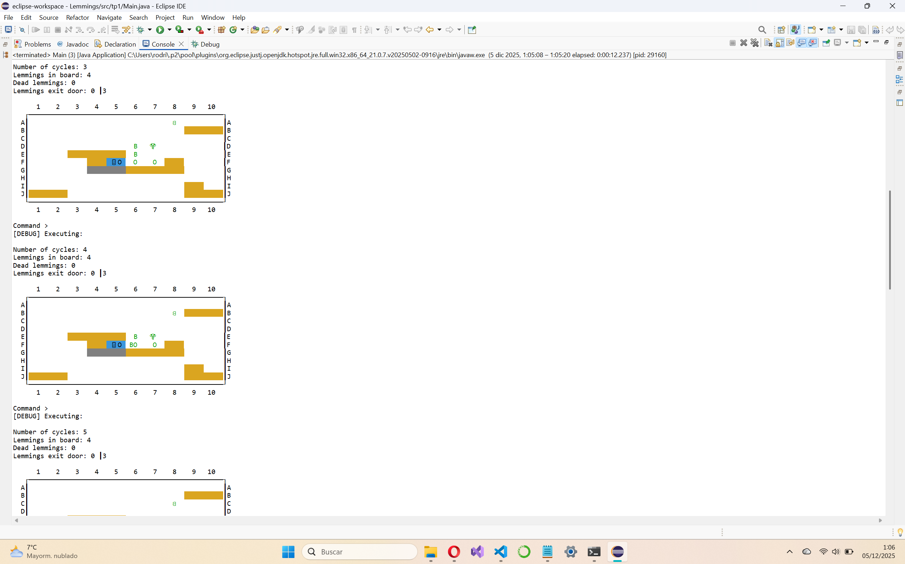
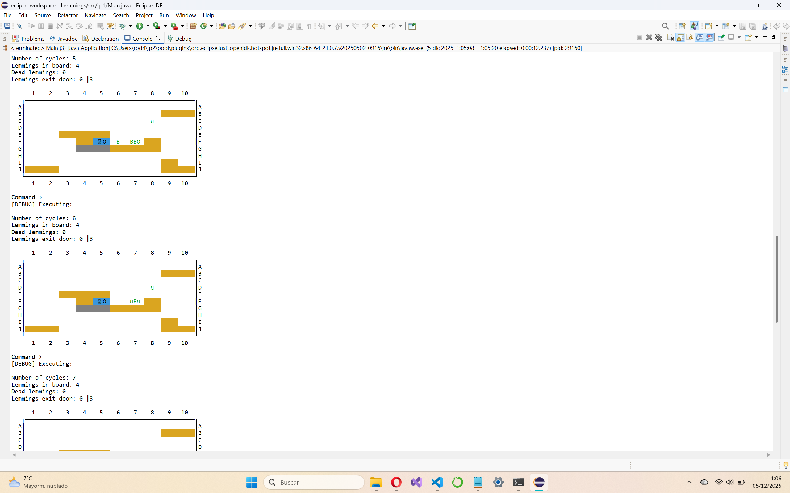
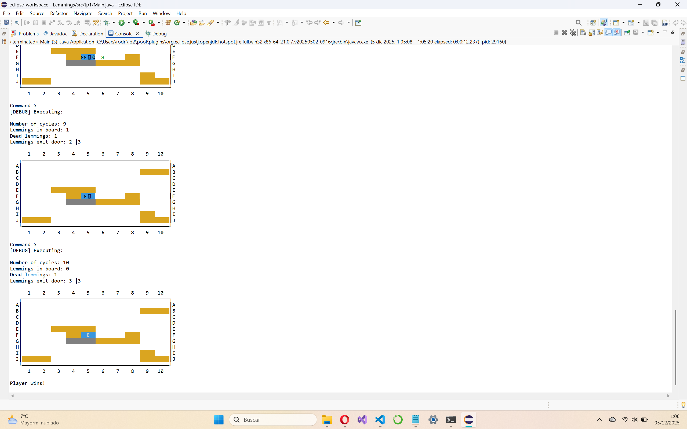

# 🐭 Lemmings – Juego de consola en Java

> Implementación de un juego inspirado en **Lemmings (1991)**, el clásico de puzles en el que hay que guiar a un grupo de lemmings hasta la salida asignándoles distintas habilidades para esquivar trampas y obstáculos.  

---

## 📋 Índice

- [Descripción general](#-descripción-general)
- [Cómo ejecutar el proyecto](#-cómo-ejecutar-el-proyecto)
- [Cómo se juega](#-cómo-se-juega)
- [Roles de los lemmings](#-roles-de-los-lemmings)
- [Elementos del tablero](#-elementos-del-tablero)
- [Arquitectura del código](#-arquitectura-del-código)
- [Sistema de guardado y carga](#-sistema-de-guardado-y-carga)
- [Trabajo futuro](#-trabajo-futuro)
- [Créditos](#-créditos)

---

## 🧠 Descripción general

Este proyecto es una práctica de la asignatura **Tecnología de la Programación** y consiste en una versión de consola del clásico **Lemmings**:

- Tablero de tamaño fijo `10 x 10`.
- Varios **lemmings** aparecen en el nivel y se mueven automáticamente.
- El objetivo es conseguir que **llegue a la puerta de salida** un número mínimo de lemmings antes de que mueran.
- El jugador no controla directamente a los lemmings, sino que les **asigna roles/habilidades** y **modifica el escenario** usando **comandos de texto**.

El motor del juego está diseñado para ser **modular y extensible**, separando claramente:

- **Modelo / lógica** del juego.
- **Controlador** (bucle principal y lectura de comandos).
- **Vista de consola** (renderizado del tablero y mensajes al usuario).

---

Aquí tienes la sección reescrita, limpia y con formato perfecto en Markdown:

---

## 🚀 Cómo ejecutar el proyecto

### **Opción 1: Usando Eclipse o IntelliJ**

1. **Clona el repositorio:**

   ```bash
   git clone https://github.com/<tu-usuario>/lemmings-java.git
   cd lemmings-java
   ```

2. **Importa el proyecto:**

   * **En Eclipse:**
     `File → Import… → Existing Projects into Workspace`
   * **En IntelliJ:**
     `File → New → Project from Existing Sources…`

3. **Verifica que la carpeta `src/` está marcada como *Source Folder*.**

4. **Ejecuta la aplicación** lanzando la clase:

   ```text
   tp1.Main
   ```

---

### **Opción 2: Compilar desde terminal**

Desde la raíz del proyecto:

```bash
javac -d out src/tp1/**/*.java
java -cp out tp1.Main
```

---

## 🎮 Cómo se juega

El juego se maneja íntegramente por **comandos de texto** introducidos en consola.

> ⚠️ **Nota:** los nombres concretos de los comandos dependen del enunciado de la práctica. Aquí se describe la idea general; adapta el README si tus comandos tienen otro nombre o sintaxis.

Algunos comandos típicos (según las clases del paquete `tp1.control.commands`):

* `help`
  Muestra la ayuda con la lista de comandos disponibles.

* `advance` / `update`
  Avanza un ciclo del juego: se mueven los lemmings, se aplican roles, colisiones, trampas, etc.

* `stats`
  Muestra estadísticas del nivel actual:

  * Ciclo actual.
  * Lemmings vivos en el tablero.
  * Lemmings muertos.
  * Lemmings que han llegado a la salida.
  * Lemmings necesarios para ganar.

* `setrole <ROL> <fila> <columna>`
  Asigna un rol a un lemming situado en la posición indicada.

  Ejemplo:

  ```text
  setrole CLIMBER 3 4
  ```

* `add <TIPO_OBJETO> <fila> <columna>`
  Inserta un objeto en el tablero (paredes, trampolín, monedas…).

* `remove <fila> <columna>`
  Elimina los objetos de una casilla.

* `save <fichero.txt>`
  Guarda el estado actual de la partida en un fichero de texto.

* `load <fichero.txt>`
  Carga una partida previamente guardada.

* `reset`
  Reinicia el nivel actual.

* `exit`
  Termina la partida.

La vista de consola (paquete `tp1.view`) se encarga de pintar el tablero y representar:

* Lemmings.
* Paredes y muros metálicos.
* Puerta de salida.
* Trampas, portales, monedas, etc.

---

## 🧩 Roles de los lemmings

Los roles se implementan en el paquete `tp1.logic.lemmingRoles` y siguen un diseño tipo **Strategy**: cada rol define el comportamiento del lemming en cada ciclo.

Algunos ejemplos de roles disponibles:

| Rol              | Descripción aproximada                                                             |
| ---------------- | ---------------------------------------------------------------------------------- |
| `WalkerRole`     | Comportamiento por defecto: camina en una dirección, gira al chocar con una pared. |
| `ClimberRole`    | Puede **escalar paredes** verticales.                                              |
| `ParachuterRole` | Cae desde alturas sin morir (paracaídas / “floater”).                              |
| `BomberRole`     | Se sacrifica explotando y destruyendo paredes cercanas.                            |
| `MuroRole`       | Actúa como **bloqueador**, haciendo que otros lemmings cambien de dirección.       |
| `JumperRole`     | Puede **saltar** para superar ciertos huecos u obstáculos.                         |
| `DownCaverRole`  | Cava hacia abajo o en diagonal, según el diseño de la práctica.                    |

El jugador decide **cuándo** y **dónde** aplicar cada rol, igual que en el juego original, para construir un camino seguro hacia la salida.

---

## 🧱 Elementos del tablero

Los elementos principales del tablero se implementan en `tp1.logic.gameobjects`:

* **Lemming** (`Lemming.java`)
  Protagonista del juego. Sigue su rol actual y puede morir por caídas, trampas u obstáculos.

* **ExitDoor**
  Puerta de salida. Cuando un lemming llega aquí, se considera **rescatado**.

* **Wall**
  Pared destructible que bloquea el paso.

* **MetalWall**
  Pared indestructible.

* **Pincho**
  Trampa letal: al caer sobre ella, el lemming muere.

* **Trampolin**
  Permite que el lemming rebote/salte.

* **Volcan**
  Zona peligrosa tipo “lava”.

* **Portal**
  Teletransporta al lemming de una posición de entrada a otra de salida.

* **Coin**
  Moneda coleccionable. El contador se lleva desde `Game` (`coinsCollected`).

Todo ello se gestiona de forma uniforme a través de la interfaz común `GameItem` / `GameObject`, que define **interacciones** entre elementos (doble despacho `interactWith(...)`).

---

## 🧬 Arquitectura del código

El proyecto sigue una separación clara Modelo–Vista–Controlador:

### `tp1`

* `Main.java`
  Punto de entrada. Inicializa el modelo (`Game`), la vista y el controlador.

### `tp1.control`

* `Controller.java`
  Implementa el bucle principal del juego:

  * Lee comandos desde la entrada estándar.
  * Los parsea y ejecuta sobre el modelo.
  * Actualiza la vista con el nuevo estado del juego.

### `tp1.control.commands`

Implementa el **patrón Command**:

* `Command` (clase base) y `CommandGenerator`.
* Comandos concretos:
  `AddObjectCommand`, `AdvanceCommand`, `ExitCommand`, `HelpCommand`,
  `LoadCommand`, `RemoveObjectCommand`, `ResetCommand`, `SaveCommand`,
  `SetRoleCommand`, `SpaunLemmingCommand`, `StatsCommand`, `UpdateCommand`, etc.

Cada comando sabe cómo:

1. Parsearse desde una línea de texto.
2. Ejecutarse sobre el `Game`.

### `tp1.logic`

**Núcleo del modelo del juego**:

* `Game`
  Clase principal del modelo. Implementa varias interfaces:

  * `GameWorld` → callbacks para que los objetos consulten el entorno (paredes, aire, puerta…).
  * `GameStatus` → información de estado (ciclo, lemmings, victoria/derrota).
  * `GameModel` → operaciones de alto nivel (cargar, guardar, resetear, actualizar).
  * `GameItem` → integración con el sistema de interacciones.

* `GameObjectContainer`
  Contenedor de todos los objetos del tablero. Se encarga de:

  * Añadir y eliminar objetos.
  * Actualizar cada objeto por ciclo.
  * Consultar qué hay en cada `Position`.
  * Gestionar colisiones e interacciones.

* `Position`
  Clase inmutable para representar coordenadas (`row`, `col`) y movimientos básicos (avanzar, retroceder…).

* `Direction`
  Enum con las direcciones posibles (`LEFT`, `RIGHT`, `UP`, `DOWN`, `NONE`).

* `FileGameConfiguration` y `GameConfiguration`
  Módulo de **persistencia**: lectura y escritura del estado de la partida desde/hacia ficheros de texto.

### `tp1.logic.gameobjects`

Contiene todas las clases que representan elementos del tablero: `Lemming`, `Wall`, `MetalWall`, `ExitDoor`, `Pincho`, `Portal`, `Trampolin`, `Volcan`, `Coin`, etc., además de la `GameObjectFactory` para construirlos a partir de texto.

### `tp1.logic.lemmingRoles`

Conjunto de roles/estrategias que modifican el comportamiento de los lemmings: `WalkerRole`, `ClimberRole`, `ParachuterRole`, `BomberRole`, `MuroRole`, `JumperRole`, `DownCaverRole`, etc.

### `tp1.view`

Responsable de la **interfaz de texto**:

* `ConsoleView`, `GameView`, `ConsoleColorsView`, `ConsoleColorsAnsiCodes`.
* `Messages` centraliza los textos mostrados al usuario (mensajes de error, ayuda, etc.).

### `tp1.exceptions`

Excepciones específicas del dominio:

* `CommandException`, `CommandExecuteException`, `CommandParseException`.
* `GameLoadException`, `GameModelException`, `GameParseException`.
* `ObjectParseException`, `OffBoardException`, `RoleParseException`.

### `tp1.util`

* `MyStringUtils`
  Funciones de utilidad para manipular cadenas, formatear la vista, etc.

---

## 💾 Sistema de guardado y carga

El formato de fichero está pensado para que sea:

* **Legible a mano**.
* **Fácil de parsear** por el programa.

### Estructura general

1. **Primera línea**: estado global del juego, generado por `Game.toString()`:

   ```text
   <cycle> <lemmingsAlive> <lemmingsDead> <lemmingsExited> <lemmingsToWin>
   ```

2. **Líneas siguientes**: un objeto por línea, serializado por `GameObject.toString()`
   y reconstruido mediante `GameObjectFactory.parse(...)`.

`FileGameConfiguration` se encarga de:

* Leer el fichero.
* Validar el formato.
* Crear el `GameObjectContainer` con todos los objetos.
* Rellenar los campos de estado del juego.

En caso de error se lanzan excepciones específicas (`GameLoadException`, `ObjectParseException`, `OffBoardException`, etc.), que el controlador captura para informar al usuario.

---

## 🖼️ Ejemplo de partida

A continuación se muestra un ejemplo real de una partida ejecutada en Eclipse, donde se ve:

- El encabezado con las estadísticas del nivel:
  - `Number of cycles`: ciclo actual de simulación.
  - `Lemmings in board`: lemmings vivos en el tablero.
  - `Dead lemmings`: lemmings que han muerto.
  - `Lemmings exit door`: lemmings que han llegado a la salida / lemmings necesarios para ganar.
- El tablero de `10 x 10` con:
  - Bloques y paredes.
  - La puerta de salida.
  - Los lemmings con sus roles correspondientes.












--- 

## 🛠️ Trabajo futuro

Algunas ideas para extender el proyecto:

* Añadir más **niveles** con distintas configuraciones de tablero.
* Implementar un **editor de niveles** basado en los comandos `add/remove`.
* Añadir más **roles** o variantes de comportamiento.
* Implementar una vista gráfica (por ejemplo, con **Swing** o **JavaFX**).
* Mejorar el sistema de puntuación utilizando monedas (`Coin`) y tiempos.

---

## 🙌 Créditos

* **Autor del proyecto**: Rodrigo Mendoza.
* **Asignatura**: Tecnología de la Programación.
* **Universidad**: Universidad Complutense de Madrid.
* Inspirado en el clásico **Lemmings (1991)** de DMA Design / Psygnosis. ([Wikipedia][1])
